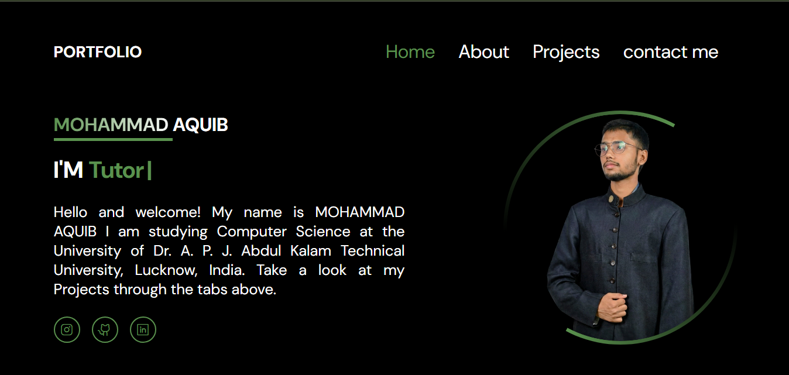

  

  

 

> **Hello and welcome! I am Mohammad Aquib, a Computer Science student studying at Dr. A. P. J. Abdul Kalam Technical University (AKTU), Lucknow, India. This portfolio serves as a centralized hub to explore my projects, skills, and academic journey.**

## 📸 Portfolio Interface

  <!-- DHYAN DEIN: Is image ko dekhne ke liye apne repo me "1001023928.jpg" zaroor upload karein -->
  
  
<i>Clean, professional, and dark-themed personal portfolio</i>

## 👨‍💻 About This Space

This digital portfolio is designed to provide a professional overview of my background and technical capabilities. 
* 🎓 **Education:** Pursuing B.Tech in Computer Science at AKTU, Lucknow.
* 💻 **Projects Hub:** A curated showcase of my best web development and software projects.
* 📱 **Responsive Design:** Optimized for seamless viewing across mobile, tablet, and desktop screens.
* 🎨 **UI/UX:** A minimalist dark theme with striking green accents to ensure readability and a modern aesthetic.

## 💻 Technology Stack

  
  
  

## ⚠️ Showcase & Copyright Policy

**© 2026 Mohammad Aquib. All Rights Reserved.**

This repository is strictly a **Showcase-Only Portfolio**. 
The source code, UI design, personal imagery, and content are proprietary. **Cloning, copying, or reusing this repository's code or design for personal or commercial projects is strictly prohibited.** You are welcome to visit the live link to experience the design.

 
 

<!-- Premium Green Divider -->

  

 

<!-- Connect With Me Section -->

  <h2 style="color: #4CAF50;">Let's Connect 🤝</h2>
  
Feel free to reach out for collaborations, projects, or just a friendly chat!

 
 
  
  
  
  

 
 

<!-- Animated Thank You Message -->

  

<!-- Premium Waving Footer in Green -->

  

